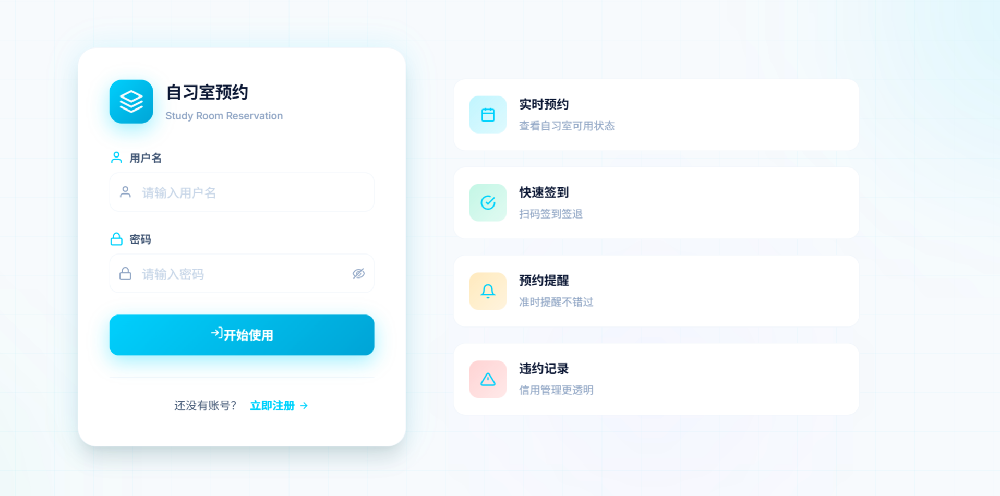
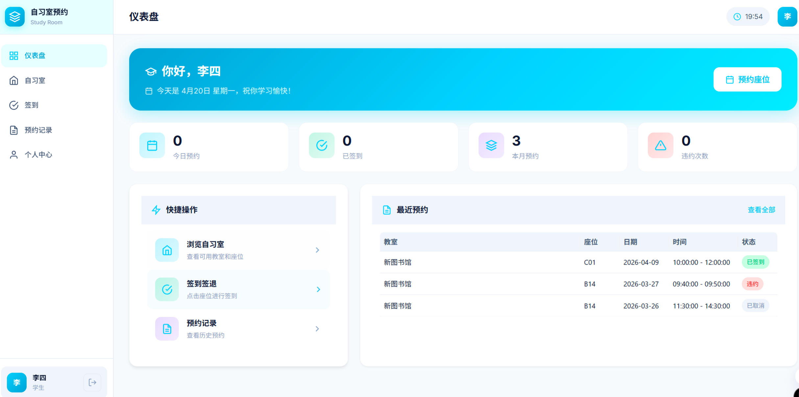
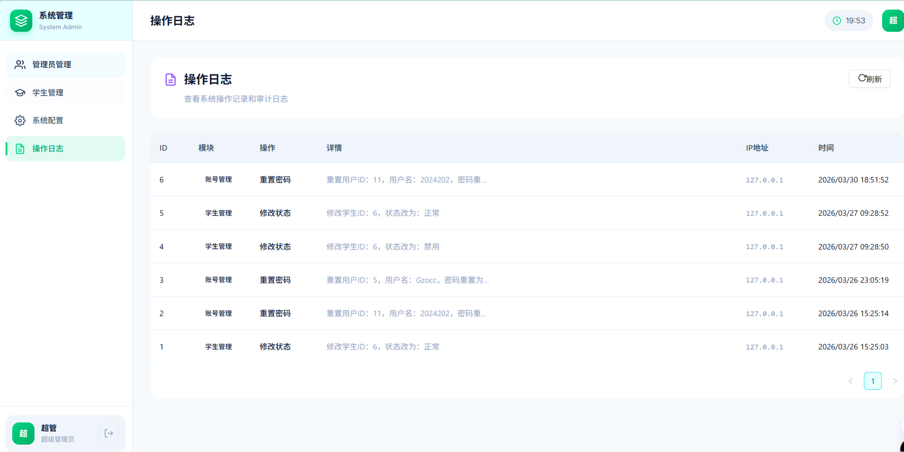

# 自习室预约管理系统

[](https://spring.io/projects/spring-boot)
[](https://vuejs.org)
[](https://mysql.com)
[](https://redis.io)
[](LICENSE)

一个功能完善的学校自习室预约管理系统，支持多角色（学生、管理员、超级管理员）权限管理，提供教室预约、签到签退、违约管理等功能。

## 功能特点

### 学生端
- 📚 查看教室及座位信息
- 📅 预约座位（支持提前预约）
- ✅ 扫码签到/签退
- 📊 查看个人预约记录
- 👤 个人中心（查看违约次数等）

### 管理端
- 🏠 教室管理（添加/编辑/开放/关闭）
- 💺 座位管理（座位布局可视化）
- 📋 预约管理（查看/取消预约）
- ⚠️ 违约记录管理
- 📈 数据统计看板

### 超级管理员
- 👥 管理员账号管理
- 👨‍🎓 学生账号管理
- ⚙️ 系统配置管理
- 📝 操作日志查看

## 技术栈

### 后端
| 技术 | 说明 |
|------|------|
| Spring Boot 3.2 | Java Web 框架 |
| MyBatis-Plus | ORM 持久层框架 |
| MySQL 8.0 | 关系型数据库 |
| Redis | 缓存与会话存储 |
| JWT | 身份认证 |
| Spring Security | 密码加密（BCrypt） |

### 前端
| 技术 | 说明 |
|------|------|
| Vue 3 | 前端框架 |
| Vue Router | 路由管理 |
| Pinia | 状态管理 |
| Ant Design Vue 4 | UI 组件库 |
| Axios | HTTP 请求 |
| Vite | 构建工具 |

## 项目结构

```
study-room-reservation/
├── backend/                 # 后端服务
│   ├── src/main/java/
│   │   └── com/hopez/studyroom/
│   │       ├── controller/  # 控制器
│   │       ├── service/    # 业务逻辑
│   │       ├── mapper/     # 数据访问
│   │       ├── entity/     # 实体类
│   │       ├── config/    # 配置类
│   │       ├── util/      # 工具类
│   │       └── common/    # 公共类
│   └── pom.xml
│
├── frontend/                # 前端服务
│   ├── src/
│   │   ├── api/           # API 接口
│   │   ├── components/   # 公共组件
│   │   ├── layouts/      # 布局组件
│   │   ├── router/      # 路由配置
│   │   ├── stores/      # 状态管理
│   │   ├── utils/       # 工具函数
│   │   └── views/       # 页面视图
│   │       ├── admin/    # 管理端
│   │       ├── student/  # 学生端
│   │       └── super/    # 超管端
│   ├── index.html
│   ├── vite.config.js
│   └── package.json
│
└── docs/
    └── database.sql      # 数据库脚本
```

## 快速开始

### 环境要求

| 软件 | 版本 |
|------|------|
| JDK | 17+ |
| Maven | 3.8+ |
| Node.js | 18+ |
| MySQL | 8.0+ |
| Redis | 6.0+ |

### 1. 克隆项目

```bash
git clone https://github.com/your-repo/study-room-reservation.git
cd study-room-reservation
```

### 2. 配置数据库

```bash
# 登录 MySQL
mysql -u root -p

# 执行 SQL 脚本
source docs/database.sql
```

### 3. 配置后端

编辑 `backend/src/main/resources/application.yml`：

```yaml
server:
  port: 8080

spring:
  datasource:
    url: jdbc:mysql://localhost:3306/study_room?useUnicode=true&characterEncoding=utf-8&serverTimezone=Asia/Shanghai
    username: your_username
    password: your_password
  
  data:
    redis:
      host: localhost
      port: 6379

mybatis-plus:
  configuration:
    log-impl: org.apache.ibatis.logging.stdout.StdOutImpl
```

### 4. 启动后端

```bash
cd backend
mvn spring-boot:run
```

后端启动成功：`http://localhost:8080`

### 5. 启动前端

```bash
cd frontend

# 安装依赖
npm install

# 启动开发服务器
npm run dev
```

前端启动成功：`http://localhost:5173`

### 6. 创建超管账号

启动后调用注册接口：

```bash
curl -X POST http://localhost:8080/api/auth/register \
  -H "Content-Type: application/json" \
  -d '{
    "username": "admin",
    "password": "admin123",
    "realName": "超级管理员",
    "role": 2
  }'
```

## 系统演示

 Coming soon... (正在截图)
### 登录页


### 学生端 - 预约座位


### 管理端 - 数据看板


## API 接口文档

### 认证模块

| 方法 | 路径 | 说明 |
|------|------|------|
| POST | /api/auth/login | 用户登录 |
| POST | /api/auth/register | 用户注册 |
| POST | /api/auth/logout | 用户登出 |

### 教室模块

| 方法 | 路径 | 说明 |
|------|------|------|
| GET | /api/rooms | 获取教室列表 |
| GET | /api/rooms/{id} | 获取教室详情 |
| POST | /api/rooms | 添加教室 |
| PUT | /api/rooms/{id} | 更新教室 |
| DELETE | /api/rooms/{id} | 删除教室 |

### 座位模块

| 方法 | 路径 | 说明 |
|------|------|------|
| GET | /api/seats/{roomId} | 获取教室座位 |
| POST | /api/seats | 添加座位 |
| PUT | /api/seats/{id} | 更新座位 |
| DELETE | /api/seats/{id} | 删除座位 |

### 预约模块

| 方法 | 路径 | 说明 |
|------|------|------|
| GET | /api/reservations | 预约列表 |
| POST | /api/reservations | 创建预约 |
| PUT | /api/reservations/{id}/cancel | 取消预约 |
| PUT | /api/reservations/{id}/checkin | 签到 |
| PUT | /api/reservations/{id}/checkout | 签退 |

### 超管模块

| 方法 | 路径 | 说明 |
|------|------|------|
| GET | /api/super/admins | 管理员列表 |
| POST | /api/super/admins | 添加管理员 |
| PUT | /api/super/admins/{id} | 更新管理员 |
| DELETE | /api/super/admins/{id} | 删除管理员 |
| GET | /api/super/students | 学生列表 |
| GET | /api/super/logs | 操作日志 |

## 系统配置

在数据库 `system_config` 表中可配置以下参数：

| 配置键 | 默认值 | 说明 |
|--------|--------|------|
| max_reserve_days | 3 | 最多提前几天预约 |
| max_reserve_per_day | 2 | 每人每天最多预约次数 |
| checkin_timeout | 30 | 签到超时时间（分钟） |
| max_violation_count | 5 | 最大违约次数 |
| reserve_duration | 4 | 单次预约最大时长（小时） |

## 常见问题

### Q: 如何修改 JWT 密钥？
A: 在 `application.yml` 中配置：
```yaml
jwt:
  secret: your-secret-key
  expiration: 86400
```

### Q: 如何开启验证码？
A: 当前版本未集成验证码，如需可自行扩展 AuthInterceptor。

### Q: 如何配置邮件通知？
A: 在 `application.yml` 中添加邮件配置，扩展邮件服务。

## 开发指南

### 添加新功能

1. **后端**：在对应模块创建 Controller → Service → Mapper
2. **前端**：在 `src/api/` 添加接口 → 在 `src/views/` 添加页面
3. **路由**：在 `src/router/index.js` 添加路由

### 代码规范

- 后端遵循 Spring Boot 官方规范
- 前端使用 ESLint + Prettier
- 提交前运行 `npm run lint`

## 部署

### Docker 部署（推荐）

```yaml
# docker-compose.yml
version: '3.8'
services:
  mysql:
    image: mysql:8.0
    environment:
      MYSQL_ROOT_PASSWORD: root123
      MYSQL_DATABASE: study_room
    ports:
      - "3306:3306"
  
  redis:
    image: redis:7-alpine
    ports:
      - "6379:6379"
  
  backend:
    build: ./backend
    ports:
      - "8080:8080"
    depends_on:
      - mysql
      - redis
  
  frontend:
    build: ./frontend
    ports:
      - "80:80"
    depends_on:
      - backend
```

### 构建生产版本

```bash
# 后端
cd backend
mvn clean package -DskipTests
java -jar target/study-room-reservation-1.0.0.jar

# 前端
cd frontend
npm run build
# 构建产物在 dist/ 目录
```

## 更新日志

### v1.0.0 (2026-4-20)
- ✅ 完成基础功能开发
- ✅ 支持多角色权限管理
- ✅ 座位预约、签到、签退
- ✅ 违约检测与记录
- ✅ 操作日志

## 贡献指南

欢迎提交 Pull Request！

1. Fork 本仓库
2. 创建特性分支 (`git checkout -b feature/xxx`)
3. 提交更改 (`git commit -m 'Add xxx'`)
4. 推送分支 (`git push origin feature/xxx`)
5. 创建 Pull Request


Made with ❤️ by Hope
所有解释权由Gzocc占有
